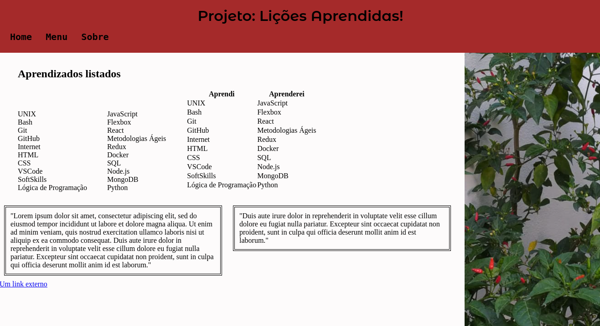

# Projeto Trybe - Lessons Learned

Este foi o primeiro projeto que desenvolvi durante o curso da Trybe, nele fui capaz de:
- Utilizar HTML para construir páginas WEB.
- Utilizar HTML semântico para tornar sua página mais acessível e melhor ranqueada.
- Utilizar CSS para adicionar estilo e posicionar elementos.

Print da aplicação:

